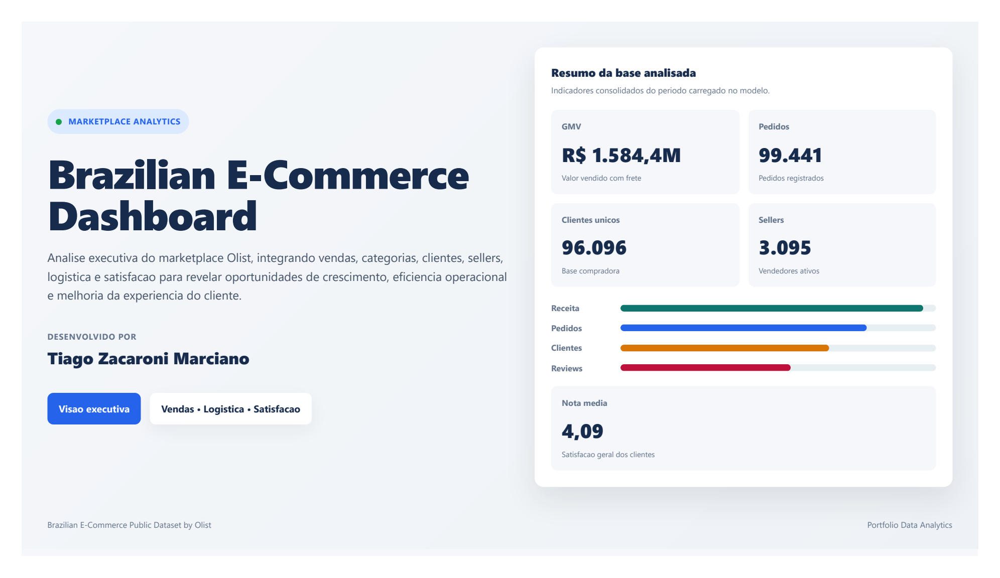
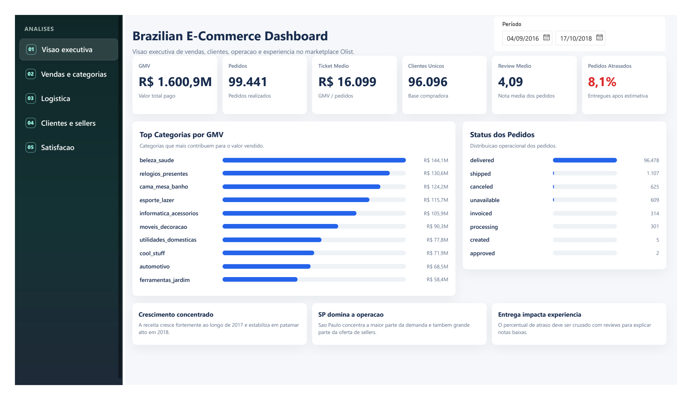

# Brazilian E-Commerce Dashboard - Olist

Dashboard executivo desenvolvido em Power BI para analisar vendas, categorias, clientes, sellers, logística e satisfação no marketplace Olist, usando o **Brazilian E-Commerce Public Dataset by Olist**.

O projeto foi construído como um produto analítico de ponta a ponta: ingestão e relacionamento das tabelas, criação de medidas DAX, estruturação de páginas de negócio, design de interface em HTML/CSS dentro do Power BI e exportação final para apresentação.

## Preview Do Dashboard

### Capa



### Visão Executiva



### Modelo Semântico


## Visão Geral

O objetivo deste projeto é transformar dados transacionais de e-commerce em um dashboard profissional para apoiar decisões de negócio.

A análise responde perguntas como:

- Como o marketplace está performando em vendas, pedidos e ticket médio?
- Quais categorias mais contribuem para o GMV?
- Como os meios de pagamento se distribuem?
- Onde estão concentrados clientes e sellers?
- Quais regiões apresentam maior atraso de entrega?
- Como o desempenho logístico impacta a satisfação do cliente?

## Arquivos Do Projeto

| Arquivo | Descrição |
|---|---|
| [Dashboard of Brazilian E-Commerce by Olist.pbix](<Dashboard of Brazilian E-Commerce by Olist.pbix>) | Arquivo principal do relatório Power BI |
| [Dashboard of Brazilian E-Commerce by Olist.pdf](<Dashboard of Brazilian E-Commerce by Olist.pdf>) | Exportação do dashboard em PDF |
| [Modelo_Semantico_Dashboard.jpg](Modelo_Semantico_Dashboard.jpg) | Print do modelo semântico desenvolvido |
| [STANDALONEhtmlContent443BE3AD55E043BF878BED274D3A6855.1.6.0.0.pbiviz](STANDALONEhtmlContent443BE3AD55E043BF878BED274D3A6855.1.6.0.0.pbiviz) | Visual customizado usado para renderizar HTML no Power BI |
| `assets/screenshots/` | Imagens exportadas do relatório para apresentação no GitHub |
| `data/` | Tabelas CSV do dataset Olist |

## Documentação Técnica

| Documento | Conteúdo |
|---|---|
| [docs/dax-measures.md](docs/dax-measures.md) | Principais medidas DAX utilizadas no modelo |
| [docs/html-measures.md](docs/html-measures.md) | Estrutura das medidas HTML e padrões de componentes |
| [docs/data-model.md](docs/data-model.md) | Modelo semântico, granularidade e relacionamentos |
| [docs/business-insights.md](docs/business-insights.md) | Leituras e oportunidades de negócio identificadas |
| [docs/methodology.md](docs/methodology.md) | Processo de desenvolvimento, validação e refinamento |
| [data/README.md](data/README.md) | Fonte dos dados e instruções para uso dos CSVs |
| [custom-visuals/README.md](custom-visuals/README.md) | Instruções de uso do visual HTML customizado |

## Fonte Dos Dados

Dataset: [Brazilian E-Commerce Public Dataset by Olist - Kaggle](https://www.kaggle.com/datasets/olistbr/brazilian-ecommerce)

O conjunto contém dados reais e anonimizados de pedidos realizados na Olist Store entre 2016 e 2018. As tabelas permitem analisar o pedido em múltiplas dimensões: status, preço, pagamento, frete, localização do cliente, atributos dos produtos, sellers e avaliações.

## Tabelas Utilizadas

| Tabela | Papel Analítico |
|---|---|
| `olist_orders_dataset` | Pedidos, status e datas da jornada de compra/entrega |
| `olist_order_items_dataset` | Itens vendidos, preço, frete, produto e seller |
| `olist_order_payments_dataset` | Tipo de pagamento, parcelas e valor pago |
| `olist_order_reviews_dataset` | Nota e comentários dos clientes |
| `olist_customers_dataset` | Cliente, cidade, estado e identificador único |
| `olist_sellers_dataset` | Seller, cidade, estado e prefixo de CEP |
| `olist_products_dataset` | Produto, categoria e atributos físicos |
| `olist_geolocation_dataset` | Coordenadas por prefixo de CEP |
| `product_category_name_translation` | Tradução das categorias de produto |
| `Dim_Calendario` | Tabela calendário criada para análises temporais |
| `Tabela_Medidas` | Organização das medidas DAX e medidas HTML |

## Páginas Do Relatório

### 1. Landing Page

Capa profissional do dashboard, com título, descrição do projeto, autoria e indicadores gerais da base.

### 2. Visão Executiva

Página de leitura rápida para responder: **como está a performance geral do e-commerce?**

Inclui:

- GMV
- Total de pedidos
- Ticket médio
- Clientes únicos
- Nota média
- Percentual de pedidos atrasados
- Top categorias
- Status dos pedidos
- Insights executivos

### 3. Vendas e Categorias

Análise da composição comercial do marketplace.

Inclui:

- Top categorias por GMV
- Participação dos meios de pagamento
- Prioridades comerciais por categoria
- Ticket aproximado
- Volume de pedidos por categoria

### 4. Logística

Análise de prazo, frete e eficiência operacional das entregas.

Inclui:

- Tempo médio de entrega
- Tempo mediano de entrega
- Percentual de entregas no prazo
- Percentual de pedidos atrasados
- Atraso médio
- Frete médio
- Atraso por estado
- Status dos pedidos

### 5. Clientes e Sellers

Análise da distribuição geográfica da demanda e da oferta.

Inclui:

- Clientes únicos
- Sellers ativos
- GMV por cliente
- GMV por seller
- Recorrência estimada
- Estados compradores
- Estados dos sellers
- Top sellers por GMV

### 6. Satisfação

Análise da experiência do cliente por meio das avaliações.

Inclui:

- Nota média
- Total de reviews
- Percentual de reviews 5 estrelas
- Percentual de reviews baixas
- Reviews com comentário
- Tempo médio de resposta
- Distribuição das notas
- Menores notas por categoria
- Comparação entre entregas no prazo e entregas atrasadas

## Principais Indicadores

Alguns indicadores construídos no modelo:

| Indicador | Objetivo |
|---|---|
| `GMV Itens` | Medir receita total considerando preço dos itens + frete |
| `Pedidos Itens` | Contar pedidos com itens vendidos |
| `Ticket Medio Itens` | Avaliar valor médio por pedido |
| `Tempo Medio Entrega Dias` | Medir o prazo médio entre compra e entrega |
| `% Pedidos Atrasados` | Monitorar pedidos entregues após a data estimada |
| `Nota Media` | Medir satisfação média dos clientes |
| `% Reviews Baixas` | Identificar proporção de experiências negativas |
| `GMV Por Cliente` | Avaliar valor médio por cliente único |
| `GMV Por Seller` | Avaliar produtividade média por vendedor |

## Exemplos De Medidas DAX

### GMV

```DAX
GMV Itens =
SUMX(
    olist_order_items_dataset,
    olist_order_items_dataset[price]
        + olist_order_items_dataset[freight_value]
)
```

### Ticket Médio

```DAX
Ticket Medio Itens =
DIVIDE(
    [GMV Itens],
    [Pedidos Itens]
)
```

### Tempo Médio De Entrega

```DAX
Tempo Medio Entrega Dias =
AVERAGEX(
    FILTER(
        olist_orders_dataset,
        NOT ISBLANK(olist_orders_dataset[order_purchase_timestamp])
            && NOT ISBLANK(olist_orders_dataset[order_delivered_customer_date])
    ),
    DIVIDE(
        DATEDIFF(
            olist_orders_dataset[order_purchase_timestamp],
            olist_orders_dataset[order_delivered_customer_date],
            HOUR
        ),
        24
    )
)
```

### Pedidos Atrasados

```DAX
Pedidos Atrasados =
CALCULATE(
    DISTINCTCOUNT(olist_orders_dataset[order_id]),
    FILTER(
        olist_orders_dataset,
        olist_orders_dataset[order_status] = "delivered"
            && NOT ISBLANK(olist_orders_dataset[order_delivered_customer_date])
            && NOT ISBLANK(olist_orders_dataset[order_estimated_delivery_date])
            && olist_orders_dataset[order_delivered_customer_date]
                > olist_orders_dataset[order_estimated_delivery_date]
    )
)
```

### Nota Média Por Categoria

```DAX
Nota Media Categoria =
VAR PedidosDaCategoria =
    CALCULATETABLE(
        VALUES(olist_order_items_dataset[order_id]),
        CROSSFILTER(
            olist_products_dataset[product_id],
            olist_order_items_dataset[product_id],
            BOTH
        )
    )

RETURN
CALCULATE(
    [Nota Media],
    TREATAS(
        PedidosDaCategoria,
        olist_order_reviews_dataset[order_id]
    )
)
```

## Decisões Técnicas

- Criação de uma `Dim_Calendario` para permitir filtros temporais consistentes.
- Organização das medidas em uma tabela dedicada (`Tabela_Medidas`).
- Uso de medidas DAX para cálculos de negócio e também para geração de HTML.
- Desenvolvimento de páginas com visual customizado em HTML/CSS dentro do Power BI.
- Uso de botões transparentes nativos do Power BI para navegação entre páginas.
- Modelagem relacional conectando pedidos, itens, pagamentos, reviews, produtos, clientes, sellers e geolocalização.
- Correção de problemas de contexto em rankings usando `CALCULATE`, `CROSSFILTER` e `TREATAS`.

## Competências Demonstradas

Este projeto demonstra competências importantes para uma posição de análise de dados:

- Modelagem de dados em Power BI
- Criação de medidas DAX intermediárias e avançadas
- Construção de KPIs orientados a negócio
- Análise comercial, logística e de satisfação
- Design de dashboards executivos
- Storytelling com dados
- Organização de relatório multi-página
- Construção de interface analítica com HTML/CSS
- Diagnóstico e correção de problemas de relacionamento e contexto de filtro
- Documentação de projeto para portfólio

## Insights De Negócio

- A receita se concentra em poucas categorias de alto volume e alto ticket.
- São Paulo aparece como principal polo de demanda e oferta, tanto em clientes quanto em sellers.
- A performance logística é um componente crítico da experiência do cliente.
- Pedidos atrasados apresentam queda relevante na nota média de avaliação.
- Reviews baixos são uma fonte importante para investigar fricções em produto, entrega e atendimento.
- A combinação entre origem dos sellers e destino dos clientes ajuda a explicar frete, prazo e satisfação.

## Como Abrir O Projeto

1. Baixe ou clone este repositório.
2. Abra o arquivo [Dashboard of Brazilian E-Commerce by Olist.pbix](<Dashboard of Brazilian E-Commerce by Olist.pbix>) no Power BI Desktop.
3. Caso necessário, instale o visual customizado [STANDALONEhtmlContent443BE3AD55E043BF878BED274D3A6855.1.6.0.0.pbiviz](STANDALONEhtmlContent443BE3AD55E043BF878BED274D3A6855.1.6.0.0.pbiviz).
4. Use o PDF exportado para uma visualização rápida do resultado final: [Dashboard of Brazilian E-Commerce by Olist.pdf](<Dashboard of Brazilian E-Commerce by Olist.pdf>).

## Resultado

O resultado final é um dashboard com abordagem executiva, visual consistente e foco em decisões de negócio. O relatório permite navegar da visão geral para análises específicas de vendas, logística, clientes, sellers e satisfação, mantendo uma experiência visual próxima de um produto analítico profissional.

---

**Desenvolvido por Tiago Zacaroni Marciano**  
Projeto de portfólio em análise de dados e business intelligence.
