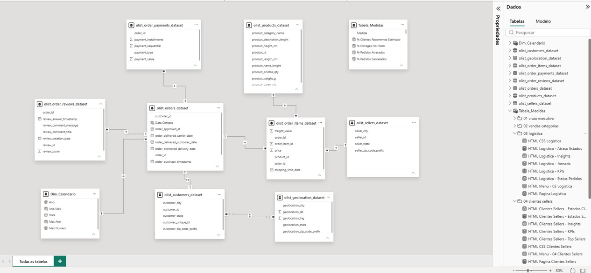

# Data Model

The dashboard uses a star-like semantic model built from the Olist CSV files.

## Model Objective

The model was designed to support five main analytical paths:

- Sales performance by date, category, state and payment type
- Logistics performance by order status, delivery dates and customer state
- Customer analysis by unique customer and geography
- Seller analysis by seller state and seller ID
- Satisfaction analysis by review score, category and delivery performance

## Main Tables

| Table | Grain | Main Use |
|---|---|---|
| `olist_orders_dataset` | One row per order | Order status, purchase date, delivery dates |
| `olist_order_items_dataset` | One row per order item | Product revenue, freight, seller and product joins |
| `olist_order_payments_dataset` | One row per payment record | Payment value, payment type and installments |
| `olist_order_reviews_dataset` | One row per review | Review score and customer comments |
| `olist_customers_dataset` | One row per customer/order record | Customer unique ID and customer location |
| `olist_sellers_dataset` | One row per seller | Seller location and seller ID |
| `olist_products_dataset` | One row per product | Product category and product attributes |
| `olist_geolocation_dataset` | One row per ZIP prefix/location record | Latitude and longitude by ZIP prefix |
| `Dim_Calendario` | One row per date | Time intelligence and date filtering |
| `Tabela_Medidas` | Measures only | Business metrics and HTML rendering measures |

## Relationship Logic

Core relationship paths:

- `customers -> orders` through `customer_id`
- `orders -> order_items` through `order_id`
- `orders -> payments` through `order_id`
- `orders -> reviews` through `order_id`
- `products -> order_items` through `product_id`
- `sellers -> order_items` through `seller_id`
- `Dim_Calendario -> orders` through purchase date

## Modeling Decisions

### Calendar Table

A dedicated `Dim_Calendario` table was created to support consistent filtering by year, month and date.

### Measure Table

`Tabela_Medidas` centralizes business measures and HTML measures. This makes the model easier to maintain and separates calculation logic from raw data tables.

### Item-Based GMV

Category and seller analysis use `GMV Itens`, calculated from `price + freight_value` in `olist_order_items_dataset`.

This avoids incorrect repeated totals when category filters do not propagate naturally to the payments table.

### Context Fixes

Some visuals required explicit context transition with `CALCULATE`, especially rankings created with `SUMMARIZE` and `ADDCOLUMNS`.

For category review score, `TREATAS` and `CROSSFILTER` were used to propagate category context to review records.

## Data Quality Considerations

- Some orders do not have final delivery dates and were excluded from delivery-time calculations.
- Delivery delay calculations use only delivered orders with both actual and estimated delivery dates.
- Payment data can include multiple payment rows per order.
- The customer table includes both `customer_id` and `customer_unique_id`; unique customer analysis uses `customer_unique_id`.
- Geolocation is available by ZIP code prefix and can contain multiple records per prefix.

## Recommended Future Improvements

- Add a distance feature between seller ZIP prefix and customer ZIP prefix.
- Create a review text classification layer for complaint themes.
- Build a seller detail page with logistics and satisfaction metrics.
- Add cohort or retention analysis using `customer_unique_id`.
- Normalize product category names into a dedicated dimension table.
